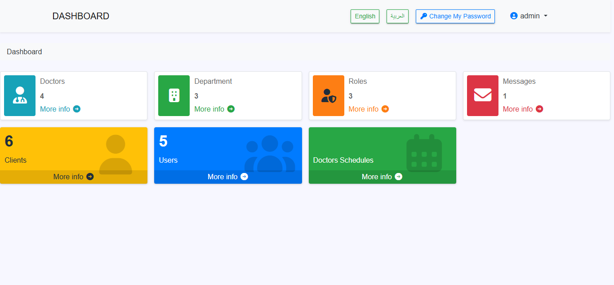
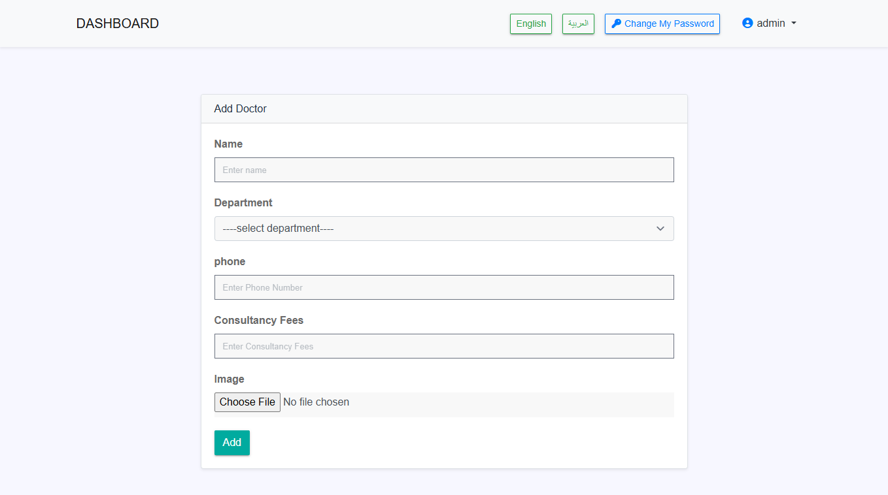
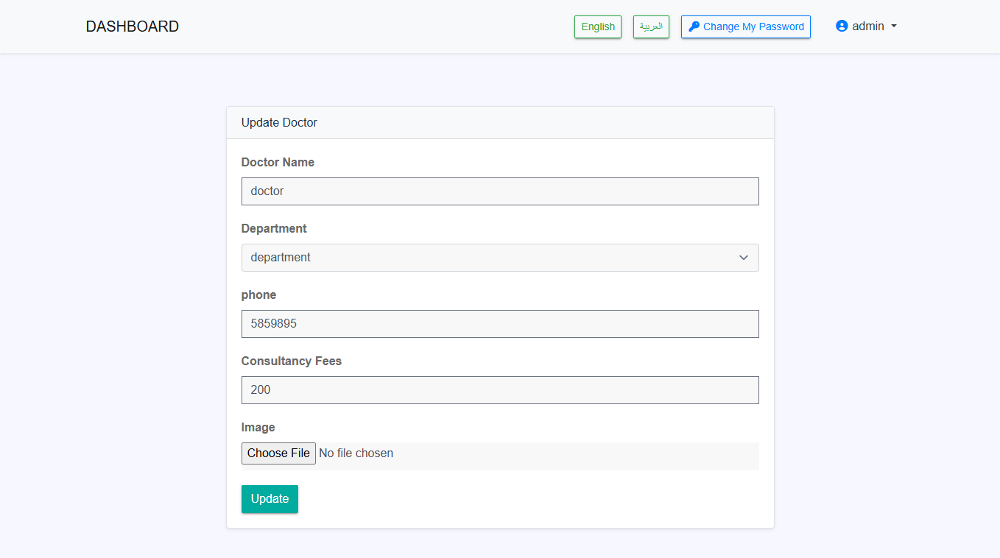
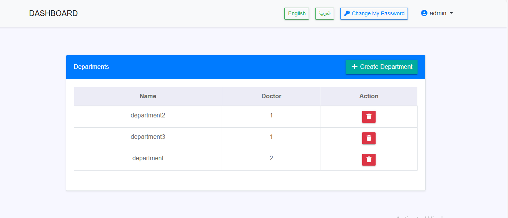
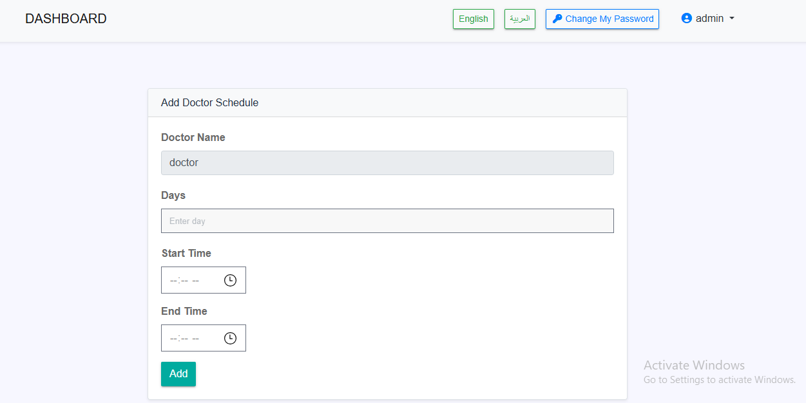
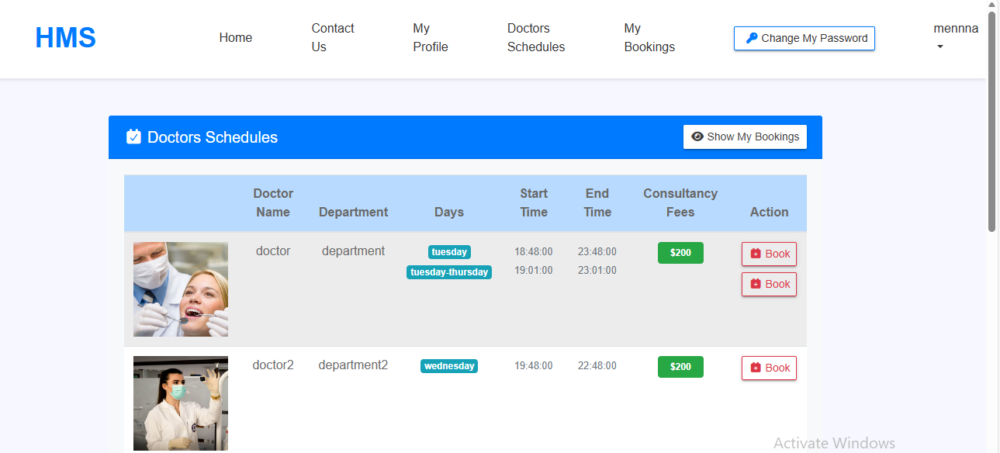
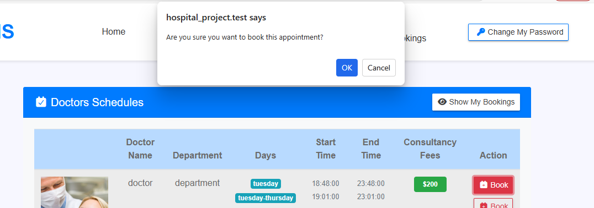
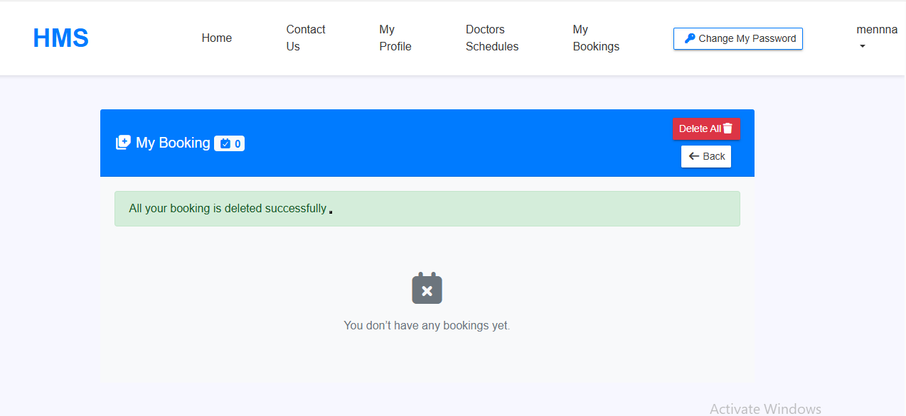

# Hospital Booking Project

## Overview
Hospital Booking Project is a hospital appointment booking system with an Admin Dashboard and client-facing pages.

## Key Features
- Admin Dashboard
- Clients booking appointments
- Role & permission management using spatie/laravel-permission
- Multi-language support using mcamara/laravel-localization
- API for accessing data and integration with other applications

## Features

### Admin Dashboard
- Manage doctors: add, edit, delete
- Manage hospital departments
- Manage clients messages
- Organize doctors’ schedules
- Manage user roles and permissions

### Client Features
- Book appointments easily

### API
- Access appointments, doctors, and departments data
- Designed for integration with mobile apps or other services

### Permissions & Localization
- **Spatie/Permissions**: precise user role and permission management
- **Mcamara Localization**: multi-language support for a better user experience

## Tech Stack
- **Backend:** Laravel (PHP)
- **Frontend:** Blade
- **Database:** MySQL

## Packages Used
- spatie/laravel-permission
- mcamara/laravel-localization

## Installation
# Install dependencies
composer install
npm install
npm run build

# Copy .env and set environment variables
cp .env.example .env
php artisan key:generate

# Run migrations
php artisan migrate

# Serve locally
php artisan serve

## Screenshots

### Admin Dashboard

### Admin - Doctors
#### Add Doctor

#### Edit Doctor

### Admin - Departments

### Admin - Appointments

### Client -  Booking
#### Doctor Schedule / Booking

#### Booking Confirmation

#### Client Appointments (Booked)

